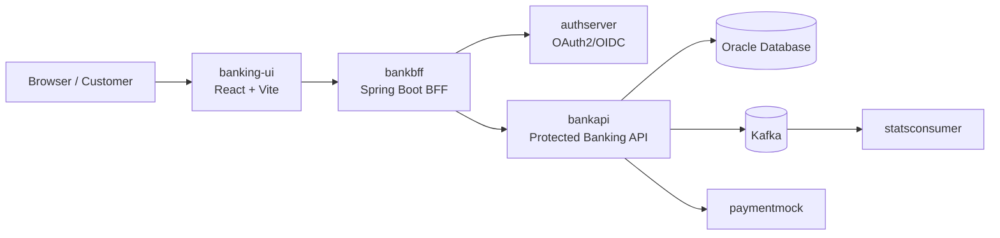

# Bank App Capstone

A full-stack banking application built with Java Spring Boot services and a React frontend. The project demonstrates a modern multi-service architecture with authentication, API protection, backend-for-frontend (BFF) logic, Kafka messaging, and Oracle-backed data access.

## Overview

This repository contains the complete capstone system split into several services:

- `authserver` – OAuth2 / OpenID Connect authorization server
- `bankapi` – protected banking resource API backed by Oracle
- `bankbff` – Spring Boot BFF that handles browser-based auth and API access
- `banking-ui` – React + Vite frontend for customer and teller workflows
- `Database` – database-related project artifacts and schema setup
- `paymentmock` – mock payment service
- `statsconsumer` – Kafka consumer for transaction stats
- `oracle` – SQL scripts for Oracle setup

## Architecture



## Technology Stack

- Java 21
- Spring Boot 3.x / 4.x depending on service
- Spring Security with OAuth2 and JWT
- React 18
- Vite
- Oracle XE via Docker
- Apache Kafka via Docker
- Maven
- Docker Compose

## Repository Structure

```text
bank-app-capstone/
├── authserver/             # OAuth2 authorization server
├── bankapi/                # Banking REST API and security config
├── bankbff/                # Backend-for-frontend
├── banking-ui/             # React frontend
├── Database/               # database project resources
├── oracle/                 # SQL scripts for Oracle setup
├── paymentmock/            # mock external payment service
├── statsconsumer/          # Kafka consumer for stats
├── docker-compose.yaml     # Oracle + Kafka infrastructure
├── README.md               # project overview
├── .gitignore
└── .gitattributes
```

## Prerequisites

Before starting the project, make sure you have:

- Java 21+
- Maven
- Node.js 20+
- npm 10+
- Docker Desktop or Docker Engine
- Git

## Infrastructure Setup

The project uses Oracle and Kafka as supporting services. Start them from the repo root:

```bash
docker compose up -d
```

This starts:

- Oracle database on port `1522`
- Kafka on port `9092`

> The Oracle container is configured with username/password values used by the banking services, such as `labuser` / `labpass123`.

## Starting the Services

### 1) Auth Server

```bash
cd authserver
./mvnw spring-boot:run
```

On Windows:

```powershell
cd authserver
mvnw.cmd spring-boot:run
```

The auth server runs on:

- `http://127.0.0.1:9000`

Important note: the auth server is configured to use the `127.0.0.1` issuer, which is required for JWT validation to work correctly.

### 2) Bank API

```bash
cd bankapi
./mvnw spring-boot:run
```

The API runs on:

- `http://localhost:8081`

### 3) BFF

```bash
cd bankbff
./mvnw spring-boot:run
```

The BFF runs on:

- `http://localhost:8080`

### 4) Frontend

```bash
cd banking-ui
npm install
npm run dev
```

The UI runs on:

- `http://localhost:5173`

## Default Login Accounts

The auth server includes demo users for testing:

| Username | Role | Notes |
|---|---|---|
| `487-978493` | `account_holder` | Alice customer |
| `500-100200` | `account_holder` | Bob customer |
| `teller1` | `teller` | Bank staff |

All demo accounts use the password:

```text
password
```

## Core Runtime Ports

| Service | URL / Port | Purpose |
|---|---:|---|
| Auth Server | `http://127.0.0.1:9000` | OAuth2/OIDC authorization server |
| BFF | `http://localhost:8080` | Browser-facing backend |
| Bank API | `http://localhost:8081` | Banking resource server |
| UI | `http://localhost:5173` | React frontend |
| Oracle | `localhost:1522` | Database |
| Kafka | `localhost:9092` | Event streaming |

## Development Notes

### OAuth / security flow

This repo uses a standard OAuth2 + BFF pattern:

- the frontend talks to the BFF
- the BFF authenticates with the authorization server
- the bank API validates JWTs from the auth server
- role-based authorization is used for account holder and teller access

### Database and messaging

- `bankapi` depends on Oracle for customer and account data
- `statsconsumer` listens for Kafka messages produced by the banking services
- `paymentmock` simulates external payment interactions

## Useful Commands

### Run all Java services in order

```bash
cd authserver && ./mvnw spring-boot:run
cd bankapi && ./mvnw spring-boot:run
cd bankbff && ./mvnw spring-boot:run
```

### Build frontend

```bash
cd banking-ui
npm run build
```

### Preview frontend build

```bash
cd banking-ui
npm run preview
```

## Notes for Contributors

- Keep service-specific config separate inside each module.
- Use the auth server issuer as `127.0.0.1` for compatibility with the JWT validation setup.
- Use the front-end and BFF on `localhost`, while the resource server and auth server should point at the `127.0.0.1` issuer.
- If you are working on database initialization, review the scripts under `oracle/` and the Docker setup in `docker-compose.yaml`.

## License

This project is intended for educational and capstone use within the repository context. Check the project-specific licenses if you plan to redistribute or extend it outside the course environment.

## Summary

This repository is a realistic multi-service banking application that combines secure authentication, backend services, a React UI, and event-driven components. It is designed to teach full-stack integration patterns in a production-like architecture while keeping the codebase easy to understand and run locally.
